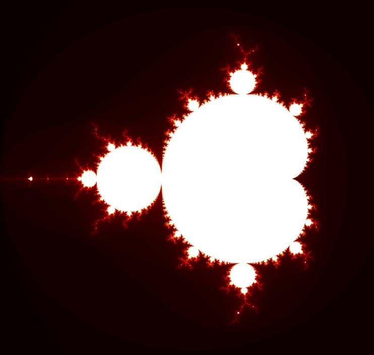

# Mandelbrot Set Visualizer

This project is a simple Python script that generates and visualizes the Mandelbrot set using NumPy for computations and Matplotlib for plotting. The Mandelbrot set is a famous fractal in mathematics, defined as the set of complex numbers \( c \) for which the sequence \( z_{n+1} = z_n^2 + c \) (starting with \( z_0 = 0 \)) remains bounded.

## Features
- Generates a square image of the Mandelbrot set within the complex plane bounds: Re from -2 to 2, Im from -2 to 2.
- Uses a maximum iteration count to determine if a point is in the set (higher iterations provide more detail but take longer).
- Command-line arguments for customizing image size and max iterations.
- Visualizes the set with a "hot" colormap, where black represents points in the set and colors indicate escape time.

## Requirements
- Python 3.x
- NumPy
- Matplotlib
- argparse (included in standard library)

Install dependencies with:
```
pip install requirements.txt
```

## Usage
Run the script from the command line:

```
python main.py --size 2048 --max-iter 128
```

- `--size` or `-s`: Sets the width and height of the image in pixels (default: 2048).
- `--max-iter` or `-m`: Sets the maximum number of iterations for each point (default: 128).

The script will compute the Mandelbrot set and display the visualization using Matplotlib.


